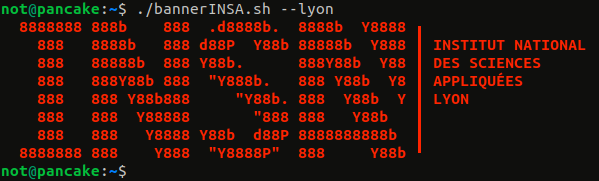
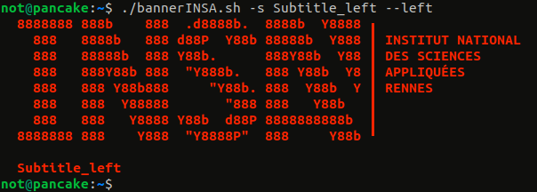
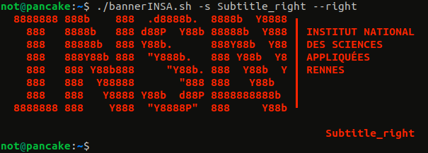
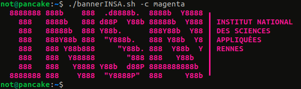
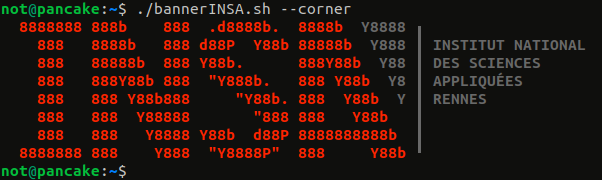
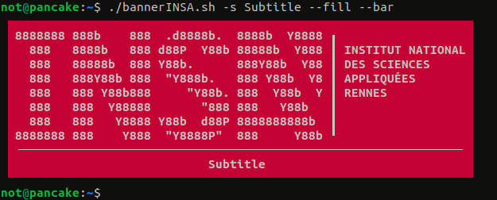

# BannerINSA

Ce script permet d'afficher une bannière du logo INSA dans une console (par exemple quand on lance un nouveau terminal).


Le script était originellement en Bash mais je l'ai aussi traduit en Python pour ceux qui utilisent d'autres interpréteurs de commandes (comme [fish](https://github.com/fish-shell/fish-shell)), cependant il requiert Python 3.6 au moins car j'utilise des f-string absolument partout. Il s'agit d'un script best-effort, il n'affichera donc (~~normalement~~) jamais de message d'erreur dans la console. Si un paramètre est invalide, la valeur par défaut sera utilisée à la place. 


# Motivations 

Faut croire que je n'avais que ça à faire


# Comment utiliser le script

```Bash
not@pancake:~$ ./bannerINSA.sh -h
bannerINSA.sh [--<insa>] [-t text] [-s subtitle] [--center | --left | --right] [-c colour] [--fill | --corner] [--bar | --sep]
```

* `--<insa>` : remplacez `<insa>` avec le nom de l'école que vous voulez afficher. Les options sont `lyon`, `rennes`,`rouen`, `toulouse`, `strasbourg`, `cvl`, `hdf` et `euromed`, la valeur par défaut est `rennes`.



* `-t text` : affiche un texte donné à droite du logo sous le nom de l'école. Ceci n'est pas fait pour afficher des textes trop longs ou sur plusieurs lignes.


* `-s subtitle` : affiche un sous-titre sous le logo. Le sous-titre doit être plus court que la largeur totale du logo et ne doit pas contenir de retour à la ligne (ce qui pourrait être changé dans le futur).


* `--center | --left | --right` : détermine la position du sous-titre par rapport au logo INSA, la valeur par défaut est `--center`




* `-c colour` : détermine la couleur du logo, les options sont `white`, `red`, `yellow`, `green`, `blue`, `magenta`, `cyan` et `black`, la valeur par défaut est `red`. Il est à noter que ces couleurs représentent les 8 couleurs affichables par un terminal, il est donc possible que vous obteniez une couleur qui ne correspond pas au nom de l'option en fonction de votre thème de couleurs, en particulier avec un thème clair (ce qui n'a pas du tout été testé).



* `--fill` : avec cette option, la couleur est appliquée à l'arrière-plan et le logo s'affiche en blanc. L'effet fonctionne bien grâce à des [caractères spéciaux](https://en.wikipedia.org/wiki/Box-drawing_character) qui peuvent ne pas s'afficher correctement sur certains terminaux (comme Alacritty par exemple).


* `--corner` : affiche le coin du logo en gris. Cette option est mutuellement exclusive avec `--fill`.



* `--bar` : affiche une fine barre entre le logo et le sous-titre s'il y en a un.



* `--sep` : Affiche un séparateur entre le nom de l'école et le texte. Cette option est mutuellement exclusive avec `--bar` car elles ne rendent pas bien ensemble.


# Assets

Le terminal que j'utilise dans les captures d'écran est gnome-terminal (le terminal par défaut sur Ubuntu). Le profil de couleur est [Blood Moon](https://github.com/dguo/blood-moon) adapté pour gnome-terminal. Ce thème a un rouge foncé qui tend vers le rose, ce qui explique pourquoi les captures d'écran avec l'option `--fill` peuvent sembler rose/magenta. En réalité, elles ont bien la couleur par défaut qui est le rouge.

Le text en ASCII art a été généré avec la police Colossal dans un générateur comme [celui-ci](https://patorjk.com/software/taag/#p=display&f=Colossal&t=INSA) (qui est basiquement une interface qui fait tourner [FIGlet](http://www.figlet.org/)), j'ai ensuite modifié un peu le 'A' pour qu'il ressemble plus au logo INSA.


:pancakes:

