# BannerINSA

This script allows the users to display the INSA logo in a console (e.g. when you launch a new terminal).

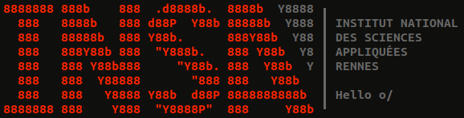

This script was originally written in Bash but I also translated it in Python for those who use other shells (like [fish](https://github.com/fish-shell/fish-shell)), although it requires Python 3.6 or above as I tend to use f-string everywhere. It is intended as a best-effort script, therefore it will (~~should~~) never print an error message in the console. If a parameter is invalid, the default value will be used instead. 


# How to use the script

```Bash
bannerINSA.sh [--<insa>] [-t text] [-s subtitle] [--center | --left | --right] [-c colour] [--fill | --corner] [--bar | --sep]
```

* `--<insa>` : replace `<insa>` with the name of the desired school. Options are `lyon`, `rennes`,`rouen`, `toulouse`, `strasbourg`, `cvl`, `hdf` and `euromed`, default is `rennes`.

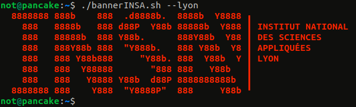

* `-t text` : displays a given text at the right of the logo, under the name of the school. This is not meant for displaying big texts or mutiline text.

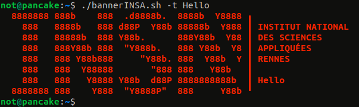

* `-s subtitle` : displays the subtitle under the INSA logo. The subtitle has to be shorter than the length of the logo and should not contain any line return (may be changed in the future).

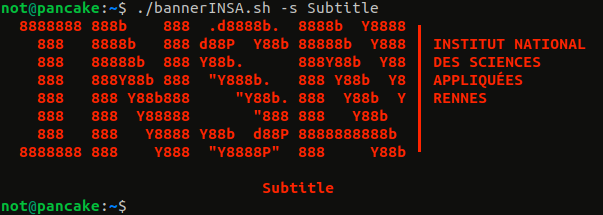

* `--center | --left | --right` : determines the alignement of the subtitle with regards to the INSA logo, default is `--center`

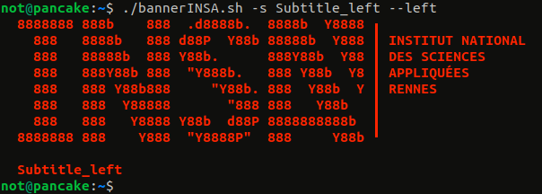
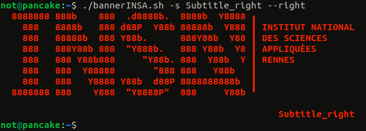

* `-c colour` : determines the colour of the logo, options are `white`, `red`, `yellow`, `green`, `blue`, `magenta`, `cyan` and `black`, default is `red`. Note that the colour provided represents one of the 8 colours supported by a terminal, hence you may obtain a colour that doesn't match the name of the option depending on your terminal's theme, specifically if you use a light theme (which has not been tested in the slightest).

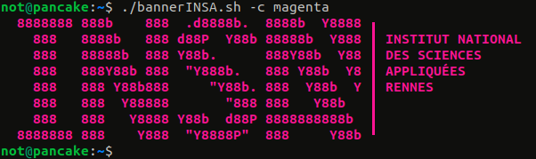

* `--fill` : with this option, the colour is applied to the background and the logo is displayed in white. The effect is nice because it uses [special characters](https://en.wikipedia.org/wiki/Box-drawing_character) that may not be rendered as intended on certain terminals (like Alacritty for example).

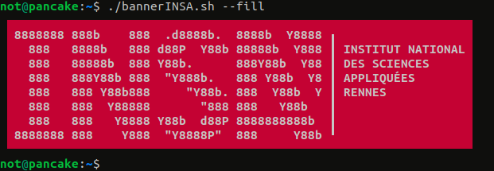

* `--corner` : displays the corner of the logo in gray. This option is mutually exclusive with `--fill`.

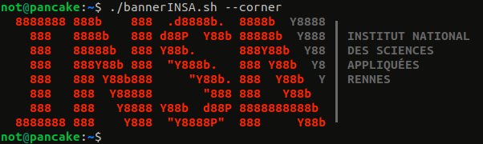

* `--bar` : displays a thin bar between the logo and the subtitle if there is one.

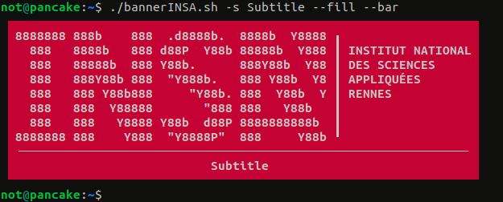

* `--sep` : displays a separator between the name of the school and the text. This option is mutually exclusive with `--bar` as they look horrendous together.

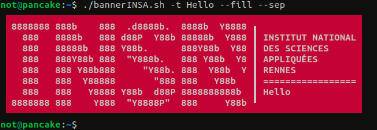


# Assets

The terminal I use in the screenshots is gnome-terminal (the default terminal in Ubuntu). My colour profile is [Blood Moon](https://github.com/dguo/blood-moon) adapted for gnome-terminal. 

The ASCII art text was generated using the font Colossal in a generator like [this one](https://patorjk.com/software/taag/#p=display&f=Colossal&t=INSA) (which is basically an interface running [FIGlet](http://www.figlet.org/)) and then modified the 'A' just a bit to resemble the INSA logo.


:pancakes:

